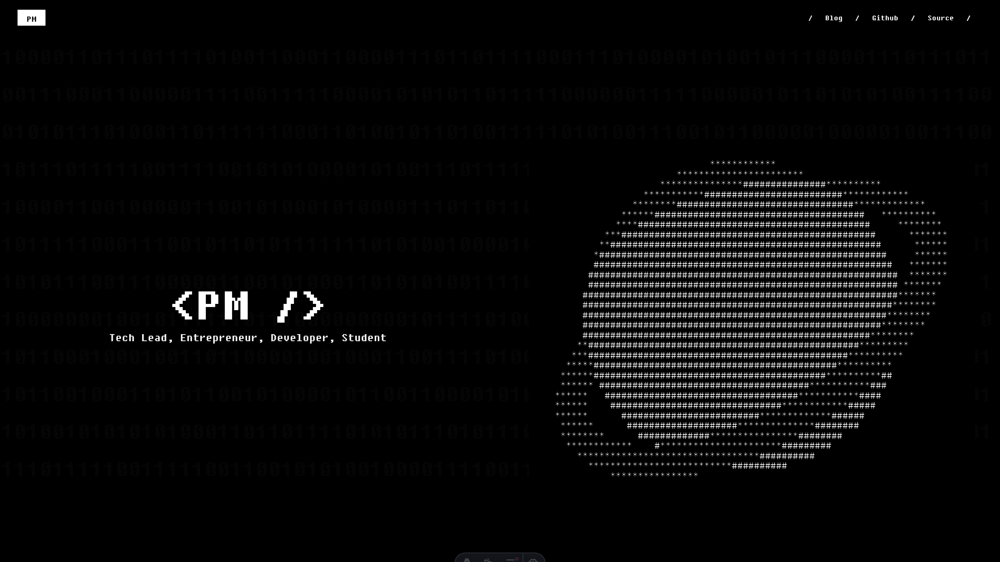

# <mangialardi.dev />

My personal portfolio website built with modern web technologies. Clean, fast, and uniquely designed to showcase my work and skills.

## Preview



## ✨ Features

- ⚡️ Built with Astro for blazing fast performance
- 🎨 Styled with Tailwind CSS for beautiful, responsive design
- 📝 Clean typography with Tailwind Typography plugin
- 🔍 SEO optimized
- 📱 Fully responsive across all devices

## 🛠️ Tech Stack

- [Astro](https://astro.build)
- [TypeScript](https://www.typescriptlang.org/)
- [Tailwind CSS](https://tailwindcss.com)

## 🚀 Getting Started

1. Clone the repository:

```bash
git clone https://github.com/mangialardi/mangialardi.dev.git
```

2. Install dependencies:

```bash
pnpm install
```

3. Start the development server:

```bash
pnpm run dev
```

4. Open your browser and navigate to `http://localhost:2222` to see the website.
